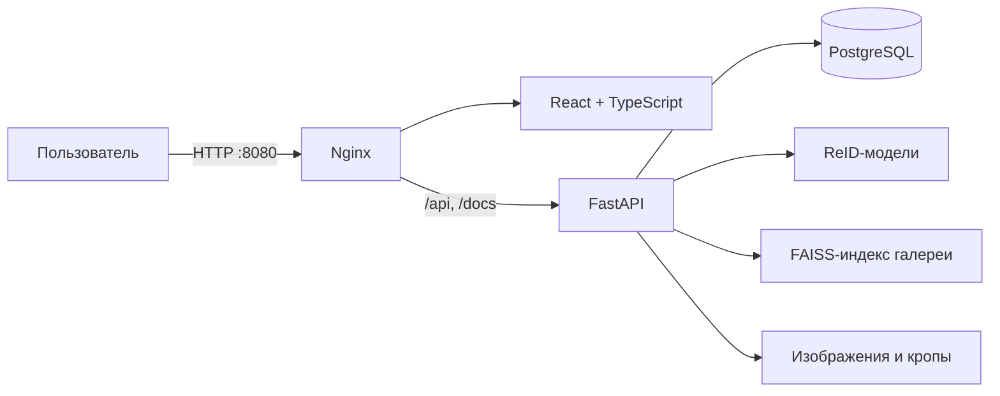

# FALCON ReID

Веб-сервис визуального поиска автомобилей по изображениям с камер наблюдения. Система формирует цифровой признак транспортного средства и находит похожие объекты в галерее без использования государственного регистрационного номера.

Проект объединяет React-интерфейс, FastAPI-бэкенд, PostgreSQL и ML-модели в единый Docker Compose-стек.

## Возможности

- регистрация и вход по JWT;
- поиск автомобиля по 1–5 фотографиям или кадрам из видео;
- выбор точного кадра и ручное кадрирование области автомобиля;
- настройка количества кандидатов и порога совпадения;
- отображение похожих автомобилей, уверенности модели и карты внимания;
- галерея кадров с поиском, фильтрацией, сортировкой и последовательной загрузкой;
- просмотр исходного кадра и копирование идентификатора изображения;
- аналитика по камерам, межкамерным трекам и истории поисков;
- watchlist, API-ключи и программная интеграция через REST API;
- интерактивная документация OpenAPI/Swagger.

## Архитектура



| Слой | Технологии |
|---|---|
| Frontend | React 18, TypeScript, Vite, Tailwind CSS, Radix UI |
| Backend | Python, FastAPI, SQLAlchemy, Pydantic |
| ML | PyTorch, timm, FAISS, YOLOv8 |
| Хранилище | PostgreSQL, файловое хранилище изображений |
| Инфраструктура | Docker Compose, Nginx |

## Быстрый запуск в Docker

### Требования

- Docker Desktop или Docker Engine;
- Docker Compose v2;
- модели и индекс в `backend/models`;
- данные галереи в `backend/data`.

Рекомендуемая структура данных:

```text
backend/
├── data/
│   ├── images/              # исходные кадры
│   ├── crops/               # кропы автомобилей
│   ├── attn/                # карты внимания, опционально
│   ├── train.csv
│   ├── test_query.csv
│   └── test_gallery.csv
└── models/
    ├── gallery_index.npz
    ├── *.pt                 # веса моделей
    ├── ensemble.json
    ├── threshold.json
    ├── postproc.json
    └── val_curves.json
```

> Тяжёлые веса, индекс и данные исключены из Git. Их необходимо разместить локально перед сборкой бэкенда.

Запустите все сервисы из корня проекта:

```bash
docker compose up --build -d
```

Первый запуск может занять несколько минут: Docker соберёт образы, запустит PostgreSQL и дождётся загрузки моделей в FastAPI.

Проверить состояние контейнеров:

```bash
docker compose ps
docker compose logs -f backend
```

После успешного запуска доступны:

| Адрес | Назначение |
|---|---|
| <http://localhost:8080> | веб-интерфейс |
| <http://localhost:8080/auth> | регистрация и вход |
| <http://localhost:8080/app> | визуальный поиск |
| <http://localhost:8080/gallery> | галерея автомобилей |
| <http://localhost:8080/analytics> | аналитика |
| <http://localhost:8000/docs> | Swagger UI |
| <http://localhost:8000/api/health> | состояние API и моделей |

Для локальной демонстрации бэкенд автоматически создаёт тестового пользователя:

```text
Логин:  test
Пароль: test
```

Остановить проект:

```bash
docker compose down
```

Удалить контейнеры вместе с томом PostgreSQL и всеми созданными аккаунтами:

```bash
docker compose down -v
```

## Настройка окружения

Docker Compose поддерживает следующие переменные:

| Переменная | Значение по умолчанию | Назначение |
|---|---|---|
| `POSTGRES_PASSWORD` | `falcon` | пароль пользователя PostgreSQL |
| `JWT_SECRET` | `falcon-local-development-secret` | секрет подписи JWT |
| `REFUSAL_THRESHOLD` | `0.302` | порог отказа модели |

Для разработки значения по умолчанию работают без дополнительной настройки. Перед развёртыванием создайте `.env` в корне проекта:

```dotenv
POSTGRES_PASSWORD=replace-with-a-strong-password
JWT_SECRET=replace-with-a-long-random-secret
REFUSAL_THRESHOLD=0.302
```

Файл `.env` исключён из Git. Не используйте демонстрационные пароли и JWT-секрет в публичном окружении.

## Работа с интерфейсом

1. Откройте страницу регистрации или войдите под тестовой учётной записью.
2. Перейдите в раздел **«Поиск»** и загрузите фотографии либо видео.
3. Для видео выберите кадр, затем при необходимости выделите область с автомобилем.
4. Настройте количество кандидатов и порог совпадения.
5. Запустите поиск и изучите кандидатов, уверенность модели и карту внимания.
6. Используйте **«Галерею»** для просмотра проиндексированных объектов и **«Аналитику»** для изучения статистики камер и поисков.

Защищённые страницы автоматически перенаправляют неавторизованного пользователя на `/auth`, а после входа возвращают его на исходный маршрут.

## Локальная разработка frontend

Бэкенд и PostgreSQL удобно оставить в Docker:

```bash
docker compose up -d postgres backend
```

Затем запустить Vite отдельно:

```bash
cd frontend
npm ci
npm run dev
```

Dev-сервер будет доступен на <http://127.0.0.1:5173>. Запросы `/api`, `/docs` и `/openapi.json` автоматически проксируются на `http://127.0.0.1:8000`.

Команды frontend:

```bash
npm run dev       # режим разработки
npm run build     # проверка TypeScript и production-сборка
npm run preview   # просмотр production-сборки
```

Если frontend и API развёрнуты на разных доменах, адрес API можно задать переменной сборки `VITE_API_URL`.

## Основные страницы

| Маршрут | Доступ | Описание |
|---|---|---|
| `/` | публичный | лендинг продукта |
| `/auth` | публичный | регистрация и вход |
| `/app` | JWT | загрузка, кадрирование и поиск автомобиля |
| `/gallery` | JWT | просмотр и фильтрация галереи |
| `/analytics` | JWT | общая и пользовательская статистика |

## REST API

Полная интерактивная документация находится по адресу <http://localhost:8000/docs>.

| Метод и маршрут | Назначение |
|---|---|
| `GET /api/health` | состояние сервиса и загруженных моделей |
| `POST /api/auth/register` | регистрация пользователя |
| `POST /api/auth/login` | получение JWT |
| `POST /api/search` | поиск кандидатов по 1–5 изображениям |
| `POST /api/embed` | получение вектора признаков изображения |
| `POST /api/explain` | генерация карты внимания |
| `POST /api/detect` | детекция автомобилей на кадре |
| `GET /api/gallery/list` | пагинированный список галереи |
| `GET /api/gallery/{id}/thumb` | миниатюра объекта |
| `GET /api/gallery/{id}/frame` | полный исходный кадр |
| `GET /api/stats/locations` | статистика камер |
| `GET /api/stats/tracks` | межкамерные треки |
| `GET /api/stats/usage` | сводная статистика поиска |
| `GET /api/stats/my` | показатели текущего пользователя |
| `GET /api/stats/my/history` | история поисков пользователя |

Защищённые методы принимают один из заголовков:

```http
Authorization: Bearer <jwt-token>
```

или для machine-to-machine интеграций:

```http
X-API-Key: falcon_<api-key>
```

API-ключ создаётся через `POST /api/auth/keys` при наличии JWT и показывается только один раз.

## Структура проекта

```text
MoscowHack/
├── frontend/                 # React-приложение
│   ├── src/components/       # страницы и UI-компоненты
│   ├── src/lib/              # API-клиент, auth и обработка видео
│   ├── public/               # статические ресурсы и ffmpeg.wasm
│   ├── Dockerfile
│   └── nginx.conf
├── backend/                  # FastAPI и ML-часть
│   ├── service/              # API, БД и сервисный слой
│   ├── src/                  # обучение и подготовка артефактов
│   ├── models/               # веса, индекс и конфигурация ансамбля
│   ├── data/                 # кадры, кропы и CSV
│   ├── api.md                # расширенное описание API
│   └── Dockerfile
├── docker-compose.yml        # общий стек приложения
├── .gitignore
└── README.md
```

## Диагностика

Проверка API:

```bash
curl http://localhost:8000/api/health
```

Логи отдельных сервисов:

```bash
docker compose logs -f frontend
docker compose logs -f backend
docker compose logs -f postgres
```

Повторная сборка после изменения frontend или backend:

```bash
docker compose up --build -d
```

Если backend остаётся в состоянии `starting`, проверьте наличие файлов в `backend/models`, содержимое `backend/data` и журнал контейнера `backend`.

## Безопасность

- замените `JWT_SECRET` и пароль PostgreSQL перед публикацией;
- не добавляйте `.env`, веса моделей, индекс галереи и реальные данные наблюдения в Git;
- используйте HTTPS и ограничение доступа к Swagger в production;
- отзовите скомпрометированные API-ключи через `DELETE /api/auth/keys/{id}`.

