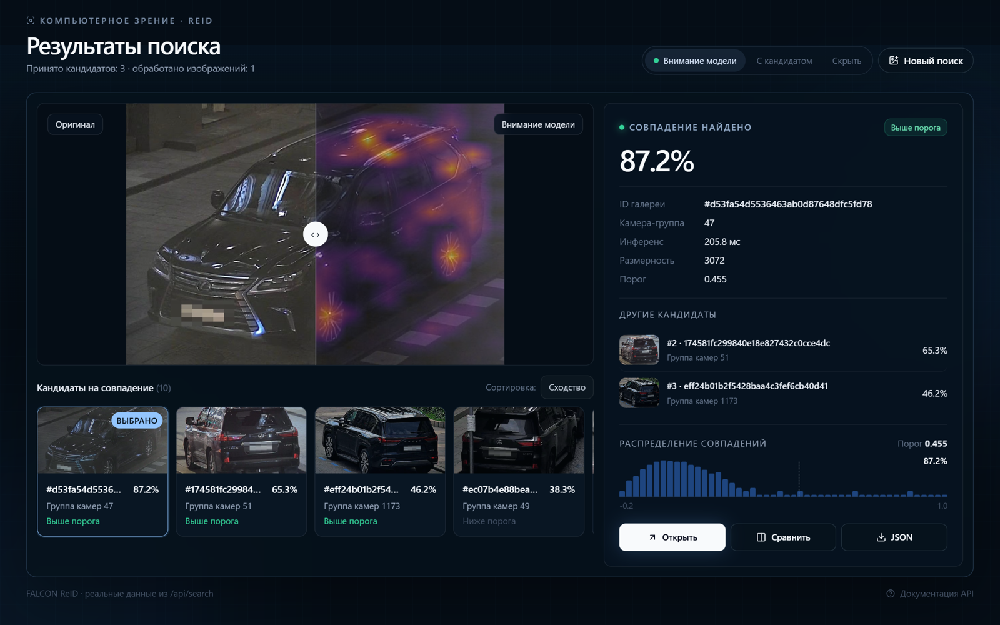
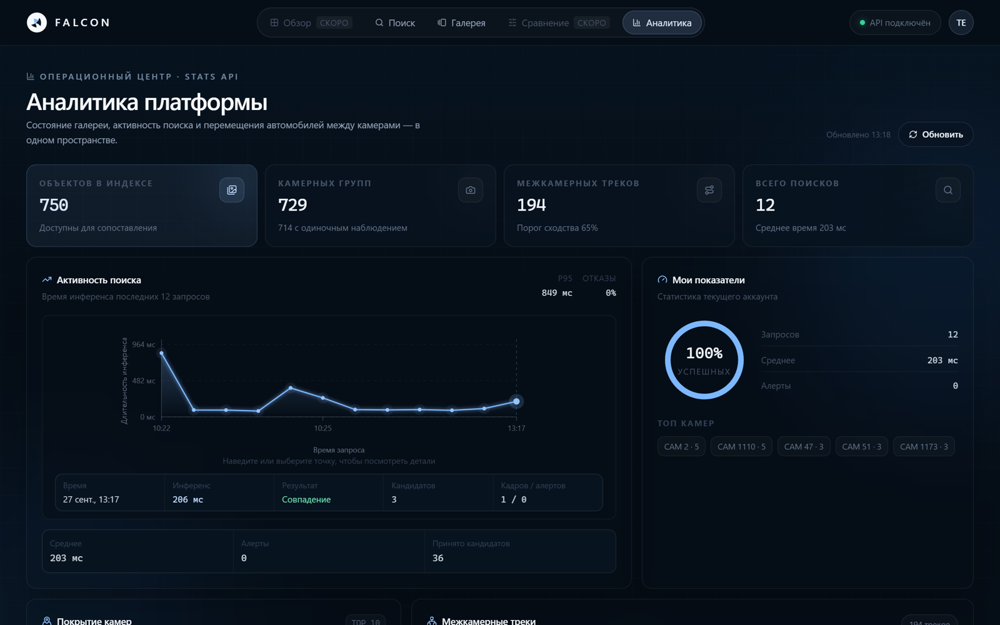
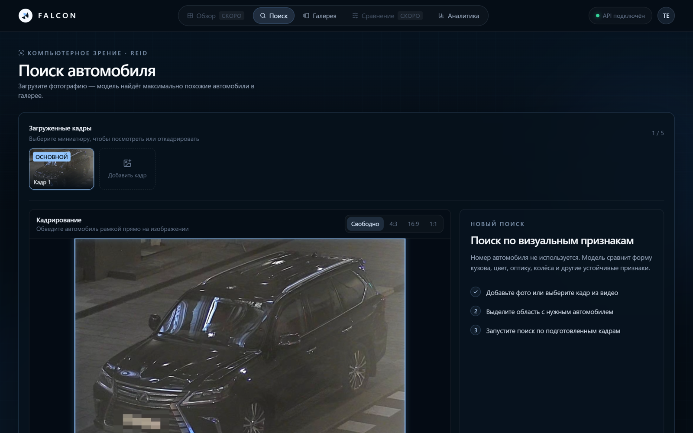
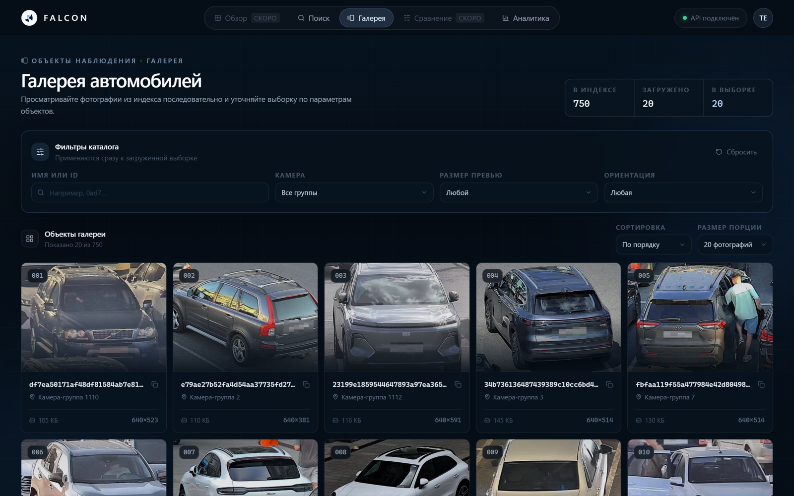
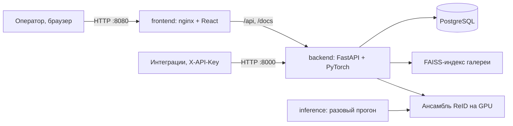

<div align="center">

# ФАЛЬКОН · ReID

**Цифровой признак транспортного средства: поиск автомобиля по внешности без государственного номера**

Кейс № 7 «Фалькон Тех» · Хакатон «Лидеры цифровой трансформации — 2026» · Команда «Брянск‑1»

<br/>

[](https://reid.up-point.tech)
[](docs/bryansk1.pdf)
[](docs/falcon_demo.mp4)
[](https://reid.up-point.tech/docs)
[](docs/ФальконТех_документация.pdf)


**Демо:** <https://reid.up-point.tech> · логин `test`, пароль `test`

</div>

---

## Содержание

1. [Общие сведения](#1-общие-сведения)
2. [Функциональное назначение и результаты](#2-функциональное-назначение-и-результаты)
3. [Описание логической структуры](#3-описание-логической-структуры)
4. [Используемые технические средства](#4-используемые-технические-средства)
5. [Вызов и загрузка](#5-вызов-и-загрузка)
6. [Входные и выходные данные](#6-входные-и-выходные-данные)
7. [Внешние ресурсы](#7-внешние-ресурсы)
8. [Соответствие требованиям ТЗ](#8-соответствие-требованиям-тз)
9. [Сопровождение](#9-сопровождение)

## 1 Общие сведения

**ФАЛЬКОН · ReID** — сервис, который по снимку автомобиля и рамке BBox строит цифровой
признак (эмбеддинг, 3072 числа) и находит тот же автомобиль на снимках других камер.
Номерной знак не используется: признак описывает цвет, геометрию кузова, оптику, диски,
наклейки и повреждения. Результат — топ‑N кандидатов с уверенностью либо обоснованный отказ,
если уверенного совпадения нет.

| Материал | Расположение |
|---|---|
| Прототип | <https://reid.up-point.tech> (логин `test` / `test`), API — <https://reid.up-point.tech/docs> |
| Презентация | [`docs/bryansk1.pdf`](docs/bryansk1.pdf), [`docs/bryansk1.pptx`](docs/bryansk1.pptx) |
| Сопроводительная документация | [`docs/ФальконТех_документация.pdf`](docs/ФальконТех_документация.pdf), [`docs/SOLUTION.md`](docs/SOLUTION.md) |
| Артефакты сдачи | [`backend/artifacts/`](backend/artifacts/): `submission.csv`, `embeddings.npy`, `candidates.csv` |
| Веса моделей | релиз [`weights-v4`](https://github.com/Enoti4Ka44/FalconREID/releases/tag/weights-v4), загружаются при сборке с проверкой sha256 |
| Журнал экспериментов | [`docs/PROGRESS.md`](docs/PROGRESS.md) |

## 2 Функциональное назначение и результаты

Сервис предназначен для поиска автомобиля в архиве городских камер, когда номер
нечитаем, скрыт или отсутствует в кадре. Оператор загружает фото или кадр из видео,
выделяет автомобиль и получает список совпадений с картой внимания модели.

Показатели на отложенной валидации (308 автомобилей, не участвовавших в обучении;
среднее по 30 переразбиениям, метрики по определениям постановщика):

| Показатель | Значение |
|---|---|
| **mAP@10** (основная метрика) | **0,859** |
| Rank‑1 / Rank‑5 | 0,823 / 0,917 |
| Порог отказа τ · F1 · TNR | 0,455 · 0,731 · 0,701 (балл 0,7·F1 + 0,3·TNR = 0,722) |
| Время на одно ТС, батч 1 | **17,1 мс** (RTX 4070 Ti SUPER); 38,6 мс (RTX 3060) |
| Пропускная способность | **126 кадр/с** (RTX 4070 Ti SUPER); 55 кадр/с (RTX 3060) |
| Суммарный размер весов | **770 МиБ** при лимите 2048 МиБ |
| Поиск в галерее 10⁶ векторов (FAISS HNSW + SQ8) | 1,07 мс на запрос, recall@10 0,87 |

| | |
|---|---|
|  |  |
|  |  |

Возможности интерфейса: поиск по 1–5 фотографиям или кадру из видео, кадрирование в
браузере, настройка топ‑N и порога на лету, карта внимания и сравнение «шторкой»,
экспорт в JSON и CSV, галерея с фильтрами, аналитика по камерам и межкамерным трекам.

## 3 Описание логической структуры



| Сервис | Технологии | Назначение |
|---|---|---|
| `frontend` | React 18, TypeScript, Vite, Tailwind, nginx | тонкий клиент: загрузка, кадрирование, поиск, галерея, аналитика |
| `backend` | Python 3.11, FastAPI, PyTorch 2.5, timm, FAISS | REST API (OpenAPI), инференс, векторный поиск, режим отказа, JWT и API‑ключи |
| `postgres` | PostgreSQL 16 | пользователи, API‑ключи, история поисков, список наблюдения |
| `inference` | образ `backend` | одна команда формирует артефакты сдачи |

Обработка запроса:

```text
кадр + BBox ─► кроп +6 % ─┬─► DINOv3 ViT-L/16 + части-признаки ─┐ вес 1,0 (1536)
                          └─► DINOv2 ViT-B/14 + части-признаки ─┘ вес 0,7 (1536)
      ─► конкатенация 3072 ─► L2 ─► DBA k=2 ─► косинус (FAISS) ─► топ-N или отказ
```

- **Модели.** Две самообученные сети разных поколений (DINOv3 и DINOv2): ошибки
  декоррелированы, ансамбль сильнее каждой. Части‑признаки по трём полосам кузова
  различают «близнецов» одной марки и цвета.
- **Обучение.** CosFace + batch‑hard triplet, память трудных негативов XBM, дистилляция
  от точной DINOv3 ViT‑H+, аугментации ракурса и перекрытий. Обучение — только на
  выданном `train.csv`.
- **Режим отказа.** Порог τ = 0,455 выбран по формуле постановщика 0,7·F1 + 0,3·TNR на
  сидах 42–61 и проверен на отложенных сидах 82–111. Порог настраивается
  (`REFUSAL_THRESHOLD`, поле `threshold` в API и интерфейсе).
- **Номерной знак не используется:** номера в данных размыты, карта внимания
  (`POST /api/explain`) показывает фокус на фарах, дисках и силуэте.

Абляции, отвергнутые идеи и анализ ошибок — в [`docs/SOLUTION.md`](docs/SOLUTION.md).

## 4 Используемые технические средства

- Docker Engine 24+ или Docker Desktop с Compose v2;
- видеокарта NVIDIA с драйвером CUDA ≥ 12.1 и [NVIDIA Container Toolkit](https://docs.nvidia.com/datacenter/cloud-native/container-toolkit/)
  (без видеокарты — режим CPU, п. 5.3);
- около 15 ГБ на диске; интернет нужен только при первой сборке.

Потребление при полном инференсе тестовой выборки: пик ОЗУ 3,3 ГБ, пик видеопамяти 1,9 ГБ,
без роста памяти при пакетной обработке.

## 5 Вызов и загрузка

### 5.1 Запуск сервиса

```bash
git clone https://github.com/Enoti4Ka44/FalconREID.git
cd FalconREID
DATA_DIR=/путь/к/датасету docker compose up --build -d
```

Через 1–3 минуты (загрузка и прогрев моделей) доступны:

| Адрес | Назначение |
|---|---|
| <http://localhost:8080> | веб‑интерфейс, логин `test` / `test` |
| <http://localhost:8000/docs> | Swagger UI (OpenAPI) |
| <http://localhost:8000/api/health> | состояние API |

### 5.2 Инференс на тестовой выборке

```bash
DATA_DIR=/путь/к/тестовой/выборке docker compose run --rm inference
```

Артефакты записываются в `./output/`. Проверка их согласованности:

```bash
docker compose run --rm inference python -m src.validate_submission --data-root /data --artifacts /app/artifacts
```

### 5.3 Запуск без видеокарты

```bash
docker compose -f docker-compose.yml -f docker-compose.cpu.yml up --build -d
```

<details>
<summary><b>Переменные окружения</b></summary>

| Переменная | По умолчанию | Назначение |
|---|---|---|
| `DATA_DIR` | `./backend/data` | каталог датасета (только чтение) |
| `OUT_DIR` | `./output` | каталог артефактов `inference` |
| `FRONTEND_PORT` / `BACKEND_PORT` | `8080` / `8000` | порты интерфейса и API |
| `REFUSAL_THRESHOLD` | τ из `models/threshold.json` (0,455) | порог отказа |
| `POSTGRES_PASSWORD` | `falcon` | пароль PostgreSQL |
| `JWT_SECRET` | `falcon-local-development-secret` | секрет подписи JWT |
| `SEED_USERNAME` / `SEED_PASSWORD` | `test` / `test` | демо‑пользователь |

Для публичного развёртывания задайте значения в `.env` и смените демо‑пароли.

</details>

<details>
<summary><b>Воспроизведение без Docker и обучение</b></summary>

```bash
cd backend
pip install -r requirements.txt --extra-index-url https://download.pytorch.org/whl/cu126
python -m src.fetch_weights                     # веса из релиза с проверкой sha256
python -m src.run_all --data-root /данные --out-dir artifacts
python -m src.rebuild_prod --train              # обучение продовых моделей
python -m src.rebuild_prod --assemble           # индекс, порог, артефакты, бенчмарк
```

Замер по протоколу стенда: `python -m src.bench_official --prod`. Подробно — [`backend/README.md`](backend/README.md).

</details>

## 6 Входные и выходные данные

**Входные данные** — каталог датасета в формате организаторов:

```text
<DATA_DIR>/
├── images/            # полные кадры JPEG или PNG, имя файла = image_id
├── test_query.csv     # image_id, x, y, w, h
├── test_gallery.csv   # image_id, x, y, w, h
└── crops/             # необязательно: готовые миниатюры
```

**Выходные данные** команды `inference`:

| Файл | Содержимое |
|---|---|
| `submission.csv` | `query_id, gallery_id_1 … gallery_id_10` — топ‑10 по убыванию близости |
| `embeddings.npy` | float32, L2‑нормированные векторы 3072: сначала query, затем gallery, в порядке CSV |
| `candidates.csv` | `query_id, gallery_id, confidence` — принятые кандидаты; при отказе строк нет |

<details>
<summary><b>REST API</b></summary>

Полная спецификация — Swagger UI (`/docs`), описание — [`backend/api.md`](backend/api.md).
Защищённые методы принимают `Authorization: Bearer <JWT>` или `X-API-Key`.

| Метод | Назначение |
|---|---|
| `POST /api/auth/register`, `/api/auth/login` | регистрация, получение JWT |
| `POST /api/search` | 1–5 снимков (+ BBox) → топ‑N с уверенностью либо отказ |
| `POST /api/batch_search` | до 32 снимков, результат на каждый |
| `POST /api/embed` | изображение (+ BBox) → вектор 3072 |
| `POST /api/explain` | карта внимания модели |
| `GET /api/gallery/*`, `/api/stats/*` | галерея, аналитика |
| `GET/POST/DELETE /api/watchlist` | список наблюдения |

```bash
TOKEN=$(curl -s -X POST localhost:8000/api/auth/login -H "Content-Type: application/json" \
  -d '{"username":"test","password":"test"}' | python -c "import sys,json;print(json.load(sys.stdin)['access_token'])")
curl -X POST localhost:8000/api/search -H "Authorization: Bearer $TOKEN" \
  -F "files=@frame.jpg" -F x=1202 -F y=270 -F w=588 -F h=474 -F top_k=10
```

</details>

## 7 Внешние ресурсы

| Ресурс | Идентификатор | Лицензия | Роль |
|---|---|---|---|
| DINOv3 ViT‑L/16 | `vit_large_patch16_dinov3.lvd1689m` | DINOv3 License (Meta) | основная модель |
| DINOv2 ViT‑B/14 reg4 | `vit_base_patch14_reg4_dinov2.lvd142m` | Apache‑2.0 | вторая модель |
| DINOv3 ViT‑H+/16 | `vit_huge_plus_patch16_dinov3.lvd1689m` | DINOv3 License (Meta) | учитель при дистилляции, в сдачу не входит |
| YOLOv8n | `yolov8n.pt` (Ultralytics) | AGPL‑3.0 | подсказка рамок в интерфейсе, в оценку не входит |

**Датасеты.** Финальные модели обучены только на выданном `train.csv`. Открытые VeRi‑776,
VRIC, BoxCars116k и синтетика CARLA проверялись в экспериментах и ухудшили качество —
в решение не вошли ([`docs/PROGRESS.md`](docs/PROGRESS.md)).

<details>
<summary><b>Библиотеки и точные версии</b></summary>

**Backend** — образ `pytorch/pytorch:2.5.1-cuda12.1-cudnn9-runtime`, Python 3.11.10;
версии зафиксированы в [`backend/requirements.txt`](backend/requirements.txt).

| Пакет | Версия | Лицензия |
|---|---|---|
| torch / torchvision | 2.5.1+cu121 / 0.20.1+cu121 | BSD‑3 |
| timm | 1.0.29 | Apache‑2.0 |
| huggingface_hub / safetensors | 2.0.0 / 0.8.0 | Apache‑2.0 |
| faiss-cpu | 1.15.0 | MIT |
| numpy / pandas / scipy / scikit-learn | 2.1.3 / 2.2.3 / 1.14.1 / 1.5.2 | BSD‑3 |
| pillow / matplotlib / tqdm | 10.4.0 / 3.9.2 / 4.67.1 | HPND / PSF / MIT |
| fastapi / uvicorn / python-multipart | 0.115.6 / 0.34.0 / 0.0.20 | MIT / BSD‑3 / Apache‑2.0 |
| pydantic / pydantic-settings | 2.10.4 / 2.7.1 | MIT |
| sqlalchemy / asyncpg | 2.0.36 / 0.30.0 | MIT / Apache‑2.0 |
| passlib / bcrypt / python-jose | 1.7.4 / 4.0.1 / 3.3.0 | BSD / Apache‑2.0 / MIT |
| ultralytics / opencv-python | 8.3.40 / 5.0.0.93 | AGPL‑3.0 / Apache‑2.0 |

**Frontend** — Node.js 22, версии в [`frontend/package-lock.json`](frontend/package-lock.json):
react / react-dom 18.3.1, vite 6.4.3, typescript 5.7.3, tailwindcss 3.4.19,
@radix-ui/* 1.1–1.3, lucide-react 0.468.0, sonner 1.7.4, clsx 2.1.1,
tailwind-merge 2.6.1, class-variance-authority 0.7.1 (MIT, ISC, Apache‑2.0);
@ffmpeg/ffmpeg 0.12.15 и @ffmpeg/util 0.12.2 (MIT), @ffmpeg/core 0.12.10 (GPL‑2.0‑or‑later,
загружается в браузер отдельным wasm‑модулем, с остальным кодом не линкуется).

**Инфраструктура:** PostgreSQL 16 (`postgres:16-alpine`), nginx 1.27 (`nginx:1.27-alpine`),
Node.js 22 (`node:22-alpine`, только сборка фронтенда).

</details>

## 8 Соответствие требованиям ТЗ

| Раздел ТЗ | Требование | Где выполнено |
|---|---|---|
| 3–4 | признак, ранжирование, топ‑N и отказ, валидация входа | `backend/src/extractor.py`, `backend/service/` |
| 6 | микросервисы, OpenAPI, тонкий клиент, Docker | `docker-compose.yml`, `/docs`, `frontend/` |
| 7 | веса ≤ 2 ГБ, без OOM, внешние ресурсы перечислены | 770 МиБ; раздел 7 |
| 8 | `submission.csv`, `embeddings.npy`, `candidates.csv`, код, офлайн‑работа | `backend/artifacts/`, `backend/src/` |
| 9 | признаки номера не используются | карта внимания, размытые номера |
| 10 | веб‑интерфейс, интерпретируемость, ANN на 10⁶, анализ ошибок | интерфейс, `/api/explain`, `src/ann_demo.py`, `docs/SOLUTION.md` |
| 12 | документация | настоящий README, [`docs/ФальконТех_документация.pdf`](docs/ФальконТех_документация.pdf) |

## 9 Сопровождение

<details>
<summary><b>Тесты и CI</b></summary>

```bash
cd backend && pip install pytest==8.3.4 && python -m pytest -q tests
```

Тесты не требуют GPU и весов: проверяют формат и согласованность артефактов сдачи,
манифест весов и лимит 2 ГБ, метрики постановщика и валидацию входа. GitHub Actions
на каждый push запускает тесты, сборку фронтенда и проверку compose‑файлов.

</details>

<details>
<summary><b>Структура репозитория</b></summary>

```text
FalconREID/
├── docker-compose.yml       # postgres + backend + frontend + inference
├── docker-compose.cpu.yml   # режим без видеокарты
├── docs/                    # документация, презентация, видео
├── frontend/                # React-клиент, nginx, Dockerfile
└── backend/
    ├── service/             # FastAPI: роутеры, сервисы, схемы, БД
    ├── src/                 # обучение, инференс, метрики, бенчмарки
    ├── models/              # манифесты, порог, веса после сборки
    ├── artifacts/           # артефакты сдачи, отчёты, скриншоты
    └── tests/               # pytest
```

</details>

<details>
<summary><b>Диагностика</b></summary>

| Симптом | Решение |
|---|---|
| `backend` долго в состоянии `starting` | модели загружаются и прогреваются: `docker compose logs -f backend` |
| `could not select device driver "nvidia"` | установите NVIDIA Container Toolkit или используйте режим CPU (п. 5.3) |
| порт занят | задайте `FRONTEND_PORT` / `BACKEND_PORT` |
| сборка упала на загрузке весов | проверьте доступ к github.com или положите файлы релиза `weights-v4` в `backend/models/` |
| нет миниатюр галереи | без каталога `crops/` сервис вырезает их из кадров при первом обращении |

</details>
