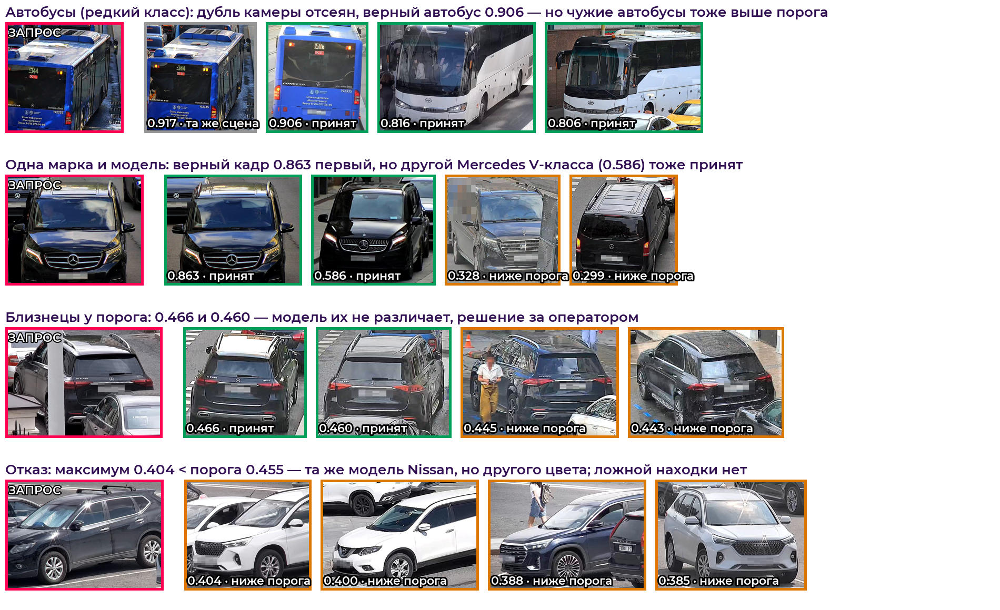

# ФАЛЬКОН·ReID — сопроводительная документация

Сервис формирования цифрового признака транспортного средства для
сопоставления снимков одного автомобиля из разных локаций без использования
государственного номера. Кейс «Фалькон Тех», ЛЦТ-2026.

---

## 1. Функциональная архитектура

Сервис реализует четыре этапа, требуемые ТЗ:

1. **Этап получения.** REST API (`POST /api/search`, `POST /api/embed`) и
   веб-интерфейс принимают изображение (полный кадр или кроп) и координаты
   BBox `x, y, w, h`. Валидация: декодируемость изображения, положительные
   размеры рамки, попадание рамки в границы кадра. Некорректный вход →
   HTTP 400 с объяснением.
2. **Этап обработки.** Полный кадр декодируется на CPU в пуле потоков, кроп по
   BBox с запасом 6% (контекст: колёса, тень, стойки кузова), бикубический
   ресайз со сглаживанием, нормализация ImageNet. Две модели —
   DINOv3 ViT-L/16 с части-признаками (256²) и DINOv2 ViT-B/14 с
   части-признаками (252²), каждая с BNNeck, — дают векторы 1536 + 1536;
   взвешенная конкатенация (1.0 / 0.7) и L2-нормировка формируют итоговый
   эмбеддинг **3072-d float32**. Постобработка: DBA k=2 (α=1.0) расширяет
   векторы статичной галереи соседями по галерее; запросы друг о друге
   ничего не знают (потоковый протокол постановщика).
3. **Этап анализа.** Косинусная близость запроса ко всем векторам галереи
   (скалярное произведение нормированных векторов). Для галерей ~10^6
   предусмотрен приближённый поиск FAISS HNSW (см. §7).
4. **Этап результата.** Сортировка по убыванию близости; выдача топ-N с
   численной уверенностью. Если максимальная близость ниже порога τ —
   **пустой ответ (отказ)** с человекочитаемым сообщением.

## 2. Компонентная архитектура (микросервисы)

```
┌──────────────────┐  HTTP :8080  ┌──────────────────────┐   ┌──────────────────────────┐
│ Браузер оператора│ ───────────► │ frontend             │   │ PostgreSQL 16            │
│ (тонкий клиент)  │              │ nginx + React SPA    │   │ пользователи, API-ключи, │
└──────────────────┘              └──────────┬───────────┘   │ история, watchlist       │
                                   /api,/docs │               └────────────▲─────────────┘
┌──────────────────┐  HTTP :8000  ┌──────────▼───────────┐                 │ SQLAlchemy
│ Интеграции (REST,│ ───────────► │ backend: FastAPI     │ ────────────────┘ + asyncpg
│ X-API-Key, MCP)  │              │ OpenAPI · JWT        │
└──────────────────┘              │ ReIDInference (GPU)  │──► ансамбль DINOv3-L + DINOv2-B
                                  │ GalleryIndex (FAISS) │──► gallery_index.npz (векторы + метаданные)
                                  └──────────────────────┘
          inference (тот же образ) ──► submission.csv · embeddings.npy · candidates.csv
```

* **frontend** — React 18 + TypeScript, собирается Vite и отдаётся nginx; nginx
  проксирует `/api`, `/docs`, `/openapi.json` на backend. Работает в любом
  современном браузере без установки ПО: загрузка фото или выбор кадра из видео
  (ffmpeg.wasm), кадрирование, поиск, карта внимания, галерея, аналитика.
* **backend** — Python 3.11, FastAPI; слои: `routers/` (HTTP и OpenAPI-описания),
  `services/` (поиск, галерея, watchlist, аудит), `schemas/` (Pydantic-валидация),
  `reid_inference.py` (модели, torch), `gallery_index.py` (FAISS, без torch).
  Модели загружаются один раз на процесс и прогреваются при старте.
* **Хранилище векторов** — FAISS `IndexFlatIP` (точный косинусный поиск) по
  `gallery_index.npz`; для 10⁶ — FAISS HNSW (`src/ann_demo.py`), путь роста —
  Milvus / pgvector без изменения API.
* **PostgreSQL** — пользователи (bcrypt), API-ключи (sha256), история поисков,
  watchlist. Доступ к API — JWT или `X-API-Key`.
* **inference** — разовый прогон на тестовой выборке тем же образом и тем же
  экстрактором, что и сервис.
* Все компоненты — в Docker; `docker compose up --build` поднимает стек,
  `docker compose run --rm inference` строит артефакты. Во время работы
  контейнеров интернет не нужен.

## 3. Методология и модель

### 3.1 Состав модели и почему именно он

| участник | вход | параметров | вес в конкатенации | файл fp16 |
|---|---|---|---|---|
| DINOv3 ViT-L/16 + части-признаки | 256² | 303M | 1.0 | 586 МиБ |
| DINOv2 ViT-B/14 + части-признаки | 252² | 87M | 0.7 | 169 МиБ |

**Самообученная инициализация.** DINOv2/v3 (самообучение на 142M и 1.7 млрд
изображений) даёт сильные признаки для fine-grained поиска при всего 9.5
тыс. обучающих снимков. Контролируемые эксперименты с внешними размеченными
датасетами (VeRi-776, VRIC, BoxCars116k — 215 тыс. кропов, 4 схемы) дали
ухудшение во всех вариантах: `runs/external_data_report.json`.

**Части-признаки.** Patch-токены режутся на 3 горизонтальные полосы, у каждой
свой 256-d эмбеддинг с BNNeck и CosFace-головой (`ReIDModelParts`) — против
«близнецов» одной модели и цвета. Для DINOv3-L они дают соло 0.8213 → 0.8318.

**Партнёр выбирается по декоррелированности, а не по силе.** Ошибки
родственных моделей (одна предобучающая выборка) совпадают, и в ансамбле они
почти ничего не добавляют. ViT-B на DINOv2 LVD-142M добавляет к DINOv3-L
больше, чем более сильные, но родственные модели.

**Компромисс «качество — скорость».** Самый точный из обученных составов —
DINOv3 ViT-H+/16@320 (841M, верхние 8 блоков из 32 дообучены: целиком модель
на 16 ГБ не помещается — одному AdamW нужно 13.5 ГБ) + ViT-B·части: mAP@10
0.8828 против 0.8585. Но по протоколу стенда он упирается в 68 FPS — 12.4
очка скорости из 20 против полных 20 у выбранной пары. По формуле
постановщика разница по качеству стоит около 1.1 очка из 45, по скорости —
около 7.6 из 20. ViT-H+ обучен и лежит в архиве.

### 3.2 Обучение

* **Функция потерь:** CE по идентичностям с отступом CosFace (s=48, m=0.25)
  + label smoothing 0.1, плюс batch-hard triplet (m=0.3) на признаках до
  BNNeck.
* **Память по батчам (XBM, Wang et al., CVPR 2020):** признаки 4096
  последних снимков хранятся без градиента и с 3-й эпохи служат
  дополнительными кандидатами в позитивы и негативы для triplet. Половина
  провалов — «почти угадал» (верный кандидат на волосок ниже ложного),
  а трудных негативов в батче из 16–32 снимков мало. Прирост в паре
  +0.0077 mAP@10 (30/30 сидов); на основной модели подтверждён средним по
  двум обучающим сидам против трёх без XBM (+0.0035 ± 0.0005), на ViT-B —
  вторым сидом (0.816 против 0.791 соло).
* **BNNeck** (Luo et al., 2019) разводит метрическое пространство triplet и
  классификационное; на инференсе используется выход BN.
* **Сэмплирование PK:** 16 идентичностей × 4 снимка (8 × 4 для крупных
  моделей с gradient checkpointing).
* **Аугментации:** **Pad + RandomCrop** (кроп расширяется на 5% и случайно
  вырезается обратно — учит устойчивости к неточной рамке детектора;
  прирост +0.0295 mAP на ViT-B, подтверждён на 30 сидах), горизонтальное
  отражение, color jitter, gaussian blur, random erasing.
* **Оптимизация:** AdamW (lr 1e-4 голова, 1e-5 backbone, wd 0.05),
  косинусный график с 2 эпохами прогрева, 30 эпох, AMP fp16.
* Продовые модели обучены на всех 1541 ТС; модели для замеров — на 1233,
  308 отложены. Сиды зафиксированы.

### 3.3 Инференс (`src/extractor.py`)

Один и тот же код строит `embeddings.npy`, индекс галереи сервиса и
меряется на скорость — сданные векторы в точности совпадают с тем, что
выдаёт измеряемый экстрактор.

* Полный кадр декодируется на CPU (libjpeg-turbo) в пуле потоков, кроп там
  же, на GPU уходит только кроп; ресайз — на GPU. Пока GPU считает порцию
  из 8 снимков, пул уже декодирует следующую. nvJPEG из torchvision
  оказался привязан к одному ядру: 5.1 мс на кадр 1920×1080 против 0.47 мс
  в пуле из 12 потоков, 66 → 126 FPS; качество то же (Δ mAP@10
  −0.0002 ± 0.0002).
* Проход каждой сети записан в **CUDA-граф** под батчи 1/8/16/32: одна
  команда на запуск вместо сотен ядер из Python. Выход совпадает с обычным
  проходом (cos = 1.00000).
* **Без TTA-отражения:** в паре моделей оно не даёт ничего (mAP@10 0.8828 →
  0.8827, Δ −0.0000 ± 0.0006), а время удваивает.
* Постобработка DBA k=2, α=1.0 по статичной галерее: +0.0086 mAP (30/30
  сидов). Прежние α=3.0 и расширение запроса AQE слишком сильно
  перевешивали ближайшего соседа.
* Скорость по протоколу стенда (`src/bench_official.py`: чтение JPEG
  1920×1080, декодирование, кроп, препроцессинг, сеть, L2; медиана 300
  прогонов после 50 прогревочных): **17.1 мс при батче 1, 126.3 FPS**
  (RTX 4070 Ti SUPER). Совместимость с Docker-образом (torch 2.5.1)
  проверена: векторы совпадают с основным окружением (cos ≥ 0.999998).

## 4. Валидационный протокол

Разбиение по идентичностям 80/20 (1233 train / 308 val), val-ТС модель
никогда не видела. Метрики — по определениям постановщика
(`src/official_metrics.py`):

* **mAP@10** — основная метрика: AP по первым 10 позициям, нормировка на
  min(n_pos, 10); junk-фильтр «то же ТС + та же камера» применяется до
  усечения; запросы без валидных позитивов исключаются.
* **Режим отказа** — F1 и TNR по запросам по верхнему кандидату; валидация
  с 20% запросов без пары, как в закрытом тесте.

**Главное методологическое правило.** Разброс mAP при пересборке разбиения
тех же 308 ТС составляет **±0.011** — больше половины типичного прироста.
Поэтому любое сравнение ведётся **парно по 30 переразбиениям**
(`src/eval_multiseed.py`): оба варианта считаются на одном разбиении,
усредняется разница; подтверждением считается |Δ| > 2·SE. Одиночный замер
однажды привёл к неверному выводу (ViT-H+: +0.0001 на одном сиде против
+0.0188 на тридцати) — история в `docs/PROGRESS.md`.

| метрика (30 сидов) | прежнее решение | текущее |
|---|---|---|
| mAP@10 | 0.8268 | **0.8585** |
| Rank-1 / Rank-5 | 0.794 / 0.900 | **0.823 / 0.917** |
| mAP полный (справочно) | 0.8347 | **0.8638** |

## 5. Режим предложения кандидатов и обоснование порога

Уверенность = косинусная близость (монотонна, интерпретируема).

**Кадры-дубли.** Тестовая галерея содержит кадры тех же сцен, что и
запросы: у 72% запросов top-1 — дубль той же машины на той же камере.
Правило по фону кадра и геометрии BBox (`src/camera_infer.py`) такие дубли
отсеивает. Важно точно понимать его природу: на train его precision
0.97–1.0 при полноте по всем одно-камерным парам 0.005 — это **фильтр
дублей**, а не восстановление разбиения по камерам.

**Выбор τ.** Балл постановщика за режим кандидатов: `10% × (0.7·F1 + 0.3·TNR)`,
где FP — «ответил, но верхний кандидат неверный» или «ответил, а пары нет».
τ выбран максимизацией этой величины на валидации с 20% запросов без пары:
отбор на сидах 42–61, проверка на отложенных 82–111
(`src/threshold_official.py`). Рабочая точка: **τ = 0.455, F1 0.731,
TNR 0.701**, балл 0.722. TNR считается как TN / (TN + FP) с FP в определении
постановщика — это нижняя оценка доли верных отказов на запросах без пары. Прежний порог 0.318 подбирался по F1 при ~50%
запросов без пары и засчитывал «ответил неверно» как верный ответ — на
реальном составе теста он давал TNR 0.44.

Отказ кодируется отсутствием строк для `query_id` в `candidates.csv`.
Обучаемый классификатор отказа (логрегрессия, бустинг на 18 признаках)
проверен и уступает одному порогу. Порог — параметр развёртывания
(`REFUSAL_THRESHOLD`).

## 6. Анализ ошибок

Разбор провалов top-1 на отложенной валидации (`src/eval_holdout.py` →
`artifacts/error_cases.json`, примеры — `artifacts/figures/errors_*.png`,
количественный разбор — `docs/PROGRESS.md`, итерации 6 и 18–21):

* **Провал представления, а не неоднозначность.** Лишь у 6% провалов разрыв
  «ложный − верный» меньше 0.05; у 42% близость лучшего верного кандидата ниже
  0.25 (у успешных запросов медиана 0.69). Модель в этих случаях просто «не
  узнаёт» машину: экстремальный ракурс или свет. Площадь рамки и число снимков
  ТС в галерее у провалов и успехов одинаковые.
* **Верный ответ рядом.** У 50% провалов он в топ-5, у 79% — в топ-10. Поэтому
  лечится качеством признака, а не ранжированием: сетка из 240 вариантов
  постобработки и k-reciprocal re-ranking дают не больше +0.001.
* **«Близнецы»** — одинаковая массовая модель, цвет и комплектация; различаются
  дисками, наклейками, повреждениями. Против них — части-признаки (соло
  0.8213 → 0.8318 для DINOv3-L) и трудные негативы из памяти XBM (+0.0077).
* **Разворот 180°** — запрос спереди, в галерее только корма. Дальше —
  мультикадровый запрос (до 5 снимков уже поддержан в API) и синтетика ракурсов.
* **Камеры-«аутсайдеры».** Камера с вытянутыми кропами (w/h ≈ 2.1) проваливается
  в 89% запросов, ночная камера — втрое чаще средней. Сохранение пропорций кропа
  (letterbox) проверено и ухудшило качество (−0.012), ночная аугментация — в
  резерве.
* **Кадры-дубли в тесте.** У 72% тестовых запросов top-1 — соседний кадр той же
  камеры; в `candidates.csv` они отсеиваются (§5), иначе режим кандидатов
  «находил» бы одну и ту же сцену.

При низкой уверенности сервис отказывает (τ = 0.455), а не выдаёт ложную находку.

### 6.1 Примеры из тестовой выборки (модель v4)



Запрос и топ-4 галереи по `embeddings.npy`; рамка: зелёная — принят (≥ τ, другая
камера), серая — кадр-дубль той же сцены (отсеивается в `candidates.csv`),
оранжевая — ниже порога. Разметки теста нет, поэтому выводы визуальные
(`src/make_test_examples.py`):

* **Редкий класс.** Для синего автобуса верный кадр с другой камеры найден (0.906),
  но выше порога проходят и чужие туристические автобусы (0.816, 0.806).
  Автобусы — около 2% обучающих кадров (оценка детектором YOLOv8n по 3000
  случайным кадрам train; в тесте — 3.3%), пространство признаков для них «сжато».
* **Одна марка и модель.** Верный Mercedes V-класса первый (0.863), но другой
  V-класс (0.586) тоже принят. F1 постановщика считается по top-1, поэтому на
  балл это не влияет, но оператору хвост списка лучше отсекать относительным
  порогом (доля от top-1).
* **Близнецы у порога.** Два GLE с уверенностью 0.466 и 0.460 — модель их не
  различает; решение за оператором.
* **Корректный отказ.** Тот же Nissan X-Trail другого цвета — 0.404 < τ, ложной
  находки нет.

## 7. Масштабирование

* Галерея 750 — точный поиск за миллисекунды.
* Городской масштаб 10^6: FAISS HNSW32 + int8-квантизация (SQ8) —
  1.07 мс/запрос при recall@10 0.87 (efSearch=512: 2.1 мс → 0.90), ускорение ×16
  к точному поиску; индекс миллиона 3072-d векторов занимает **2.9 ГБ RAM**
  (путь сжатия — отбеливание до 256-d: в 15 раз меньше памяти ценой −0.029 mAP,
  замер в docs/PROGRESS.md).
  Замер: `artifacts/ann_demo.json`; галерея демо построена на геометрии
  реальных эмбеддингов теста.
* Горизонтально: stateless API-реплики за балансировщиком; индекс — в
  выделенном сервисе (Milvus/pgvector) с шардированием по времени/округам.
* Пакетная обработка потока: динамическое батчирование инференса
  (очередь), замер FPS — `src/benchmark.py`.

## 8. Запуск и воспроизведение

Подробно — корневой `README.md`. Кратко:

```bash
DATA_DIR=/данные docker compose up --build -d          # UI :8080, API/Swagger :8000
DATA_DIR=/данные docker compose run --rm inference     # артефакты сдачи -> ./output
```

Проверено: артефакты, построенные в Docker (torch 2.5.1), совпадают с
артефактами репозитория (torch 2.14): cos векторов ≥ 0.999997, top-1 совпадает у
всех 1110 запросов, `candidates.csv` идентичен, самопроверка
`src.validate_submission` пройдена. Проверен и сценарий закрытого теста
(другие `image_id`, PNG-кадры, устаревший кэш в каталоге вывода).

## 9. Соответствие требованиям и ограничениям

| Требование ТЗ | Выполнение |
|---|---|
| Эмбеддинг фиксированной размерности | 3072-d float32, L2-норм |
| Мера близости | косинус |
| Топ-N + отказ | `/api/search`, порог τ обоснован |
| OpenAPI | `/docs`, `/openapi.json` |
| СУБД | PostgreSQL 16 (пользователи, история, watchlist), FAISS (векторы галереи) |
| Тонкий клиент | React SPA в браузере |
| Docker, одна команда | `docker compose up --build`, `docker compose run --rm inference` |
| Офлайн-инференс | веса скачиваются при сборке с проверкой sha256, запуск офлайн, `HF_HUB_OFFLINE=1` |
| Веса ≤ 2 ГБ | 770 МиБ (модели + индекс + детектор); все `.pt`/`.npz`/`.npy` репозитория — 858 МиБ |
| Без OOM | полный инференс теста: пик RAM 3.3 ГБ, VRAM 1.9 ГБ |
| Потоковый протокол | каждый запрос независим, используется только галерея |
| Точные версии пакетов | `requirements.txt`, `requirements.docker.txt` |
| Без признаков номера | номера размыты в данных; attention-карты подтверждают |
| Python/открытое ПО | PyTorch, FastAPI, FAISS (BSD/MIT/Apache) |

## 10. Список внешних библиотек и датасетов

Полный список с точными версиями и лицензиями — корневой `README.md`, раздел
«Внешние ресурсы»; версии зафиксированы в `requirements.txt` (среда обучения) и
`requirements.docker.txt` (образ).

* **Предобученные веса** (публичные, timm / Hugging Face): DINOv3 ViT-L/16
  `vit_large_patch16_dinov3.lvd1689m` и DINOv2 ViT-B/14
  `vit_base_patch14_reg4_dinov2.lvd142m` — инициализация участников;
  DINOv3 ViT-H+/16 `vit_huge_plus_patch16_dinov3.lvd1689m` — только учитель при
  дистилляции, в состав сдачи не входит; YOLOv8n — подсказка рамок в интерфейсе.
* **Датасеты.** Финальные модели обучены только на выданном `train.csv`.
  Открытые VeRi-776, VRIC, BoxCars116k и CARLA-синтетика проверялись в
  экспериментах (4 схемы, 215 тыс. кропов) и ухудшили качество — в финальное
  решение не вошли.
